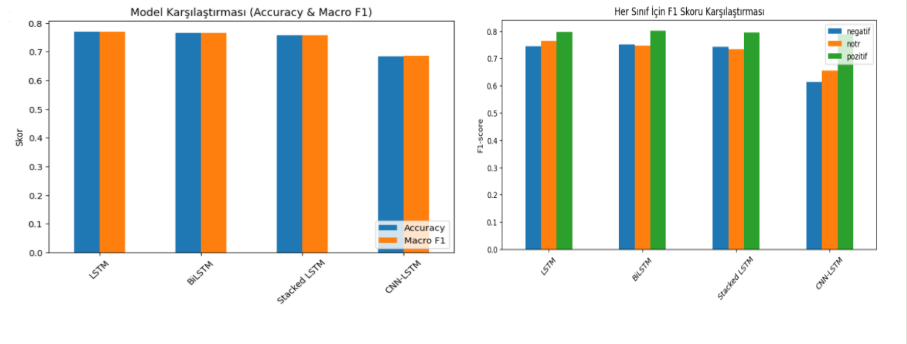

# Türkçe Duygu Analizi — LSTM Tabanlı Model Karşılaştırmaları

Bu proje, Türkçe e-ticaret yorumları üzerinde **duygu analizi** (negatif / nötr / pozitif) gerçekleştirmek amacıyla geliştirilmiştir.  
Çalışmada birden fazla veri seti birleştirilmiş, **Zemberek** ile morfolojik analiz & tokenizasyon uygulanmış, **NLPaug** ile BERT tabanlı bağlamsal veri artırma yapılmış ve farklı derin öğrenme mimarileri karşılaştırılmıştır.

---

## 📊 Veri
- **Kaynaklar**: `Datasets/` klasöründeki 4 farklı veri seti birleştirilmiştir:  
  - `e-ticaret_yorumlari_temizlenmis.xlsx`  
  - `e-ticaret_urun_yorumlari.csv`  
  - `magaza_yorumlari_duygu_analizi.csv`  
  - `cluster_base_undersampling_veri_seti.xlsx`  
- **Etiketler**: `negatif`, `notr`, `pozitif`
- **Dağılım**: Pozitif (60k), Negatif (20k), Nötr (5k)
- **Dengeleme**: Pozitif (10k), Negatif (10k), Nötr (5k+)  
- **Veri Artırma**: `nlpaug` ile BERT tabanlı bağlamsal artırma (özellikle nötr sınıf için)  

---

## 🔧 Ön İşleme (Zemberek destekli)
- URL, HTML ve noktalama temizleme  
- **Zemberek Morphology** → kök bulma  
- **Zemberek Spell Checker** → imla düzeltme  
- **Zemberek Tokenizer** → kelime tokenizasyonu  
- Türkçe stopwords (NLTK + ek liste)  

---

## 🧠 Kullanılan Modeller
Projede aşağıdaki derin öğrenme mimarileri denenmiştir:  
- **LSTM (tek katmanlı)**  
- **Stacked LSTM (3 katmanlı)**  
- **CNN-LSTM**  
- **BiLSTM (çift yönlü)**  

Tüm modellerde:
- Embedding Layer  
- LSTM / BiLSTM / CNN-LSTM katmanları  
- Dropout  
- Dense + Softmax (3 sınıf)  
yapısı kullanılmıştır.  

---

## 📈 Sonuçlar

### 1️⃣ Temel Model Karşılaştırmaları

| Model | Özellikler | Val Accuracy | Macro F1 | Eğitim Notları |
|---|---|---:|---:|---|
| LSTM (tek katmanlı) | Embedding(128), LSTM(128), Dropout(0.5), Dense(3) | %77 | %76.8 | Baseline |
| Stacked LSTM (3 layer) | 3×LSTM (128-128-64), Dropout, Dense | %76 | %76 | Daha derin yapı |
| CNN-LSTM | Conv1D + MaxPool + LSTM(128) + Dense(3) |  %68 | %69 | Hızlı öğrenme |
| BiLSTM | Embedding(128), BiLSTM(128), Dense(3) | %76 | %76 | Çift yönlü bağlam |

### LSTM Modelleri Karşılaştırma Grafikleri



---
## ⚙️ Kurulum ve Çalıştırma

### 1. Bağımlılıklar
```bash
pip install tensorflow pandas numpy scikit-learn nltk jpype1 nlpaug 

